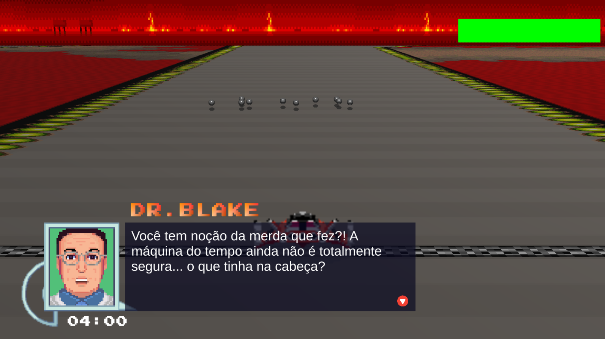

<h5 align="center">
  
  &nbsp;&nbsp;&nbsp; 
  
  <br>  
  <br>  
  <b>A FZero-like game</b> 🚘
</h5>
<p align="center">
  
</p>

## :open_book: About
This project is a recreation of the game Fzero with inspirations from Star Fox. In the game, you control a student guided by his tutor, who is a scientist, and try to escape the past with the aircraft.

<!-- > Play on [Itch.io](https://pferreirafabricio.itch.io) -->

## 👀 Overview

<!-- https://user-images.githubusercontent.com/42717522/134168449-81d6662c-acc7-49ae-afb2-0f574ef2922d.mp4 -->

<p align="center">
   <br/><br/>
   <br/><br/>
   <br/><br/>
   <br/><br/>
   <br/><br/>
</p>

## :bricks: This project was built with: 
- [Unity](https://unity.com/)
- [C#](https://docs.microsoft.com/en-us/dotnet/csharp/)
- [Blender](https://www.blender.org/)

## :running_man: Installing and Running  
 1. Clone this repository `git clone https://github.com/coetus-jd/time-race`;
 2. Open `time-race` folder with Unity and be happy 😄.
 
## :handshake: Contributors
 - [Alberto Luigi Venciguerra](https://www.instagram.com/alvenciguerra/) - Graphic Design, Level Design
 - [Bruno Ganade Alves ](https://github.com/Ganade) - UI/UX, SFX, OST
 - [Fabrício Pinto Ferreira](https://github.com/pferreirafabricio) - Coding and testing
 - [Gabriel Henrique Mantovani De Oliveira](https://github.com/MantovaniGabriel) - Screenplay
 - [João Frederico Kraft Cuppi](https://github.com/JoaoFKraft) - UI/UX, Level Design
 - [Leonardo Rezende Nakashima](https://github.com/waterwhirl) - Coding and testing

## :recycle: Contribute
 1. Fork this repository;
 2. Create a branch with your feature: ```git checkout -b my-feature```
 3. Commit your changes: ```git commit -m 'feat: My new feature'```
 4. Push your branch: ```git push origin my-feature```
 
## :page_with_curl:	License
This project is under the GPL-3.0 License. Take a look at the [LICENSE](LICENSE) file for more details.
